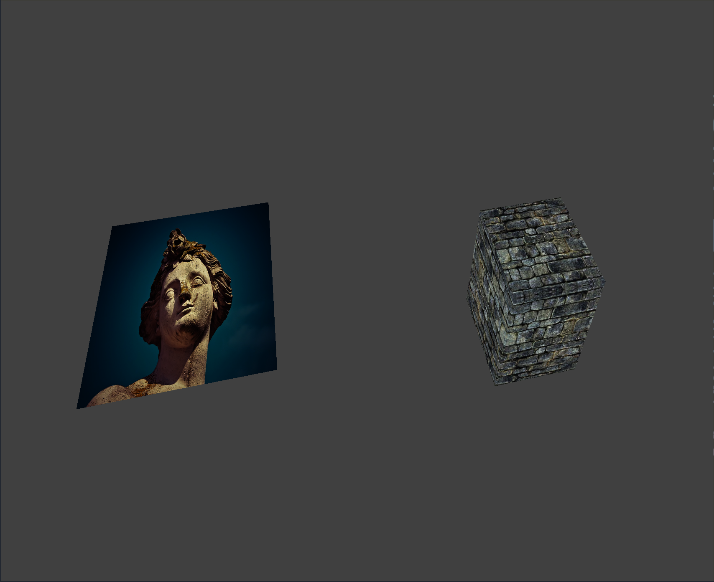

# SlashEngine

My attempt to create a game engine from scratch

Usage example can be found in TestApp folder

## Build instructions

Dependencies mostly handled by `conan` but you would also need [VulkanSDK](https://www.lunarg.com/vulkan-sdk/)

Steps:
```
$ git clone https://github.com/ShadowCurse/SlashEngine.git
$ cd SlashEngine
$ mkdir build && cd build
$ conan install .. --build=missing
$ cmake ..
$ make -j
```
TestApp binary will be in `build/bin`

To launch run:
```
./build/bin/TestApp
```

## Example

